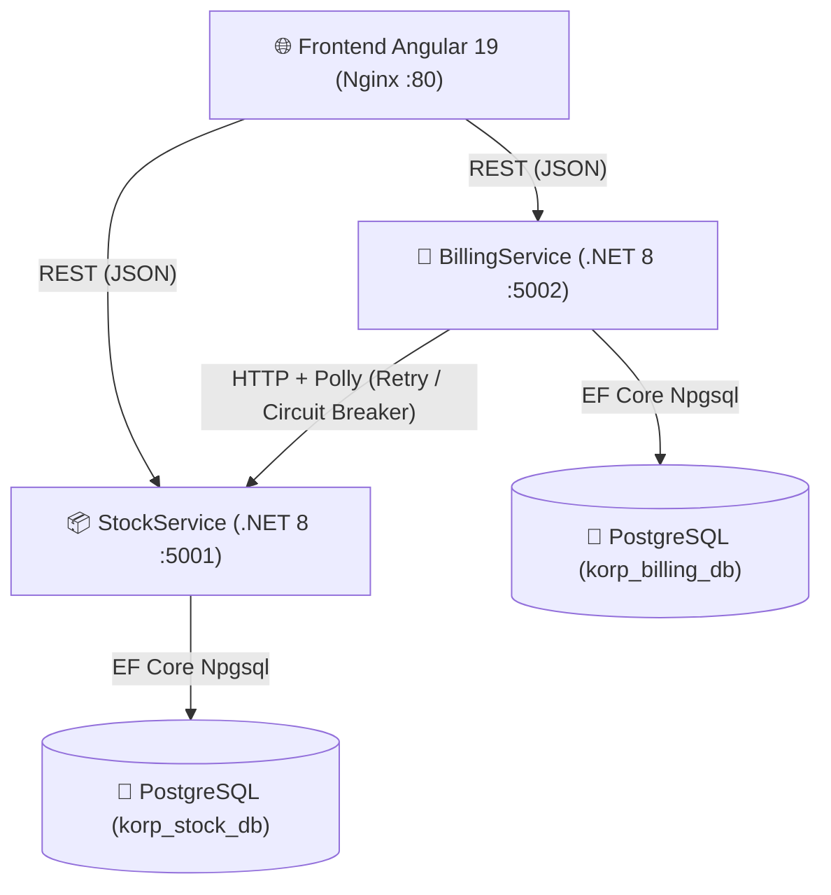

# KORP ERP - Sistema de Emissão de Notas Fiscais e Controle de Estoque

Sistema corporativo de gestão e faturamento empresarial desenvolvido em arquitetura de **Microsserviços**, com backend em **C# (.NET 8)**, persistência relacional em **PostgreSQL**, containerização com **Docker Compose** e frontend reativo em **Angular 19**.

---

## 🏛️ Arquitetura da Solução

O sistema adota o desacoplamento de responsabilidades através de dois microsserviços autônomos, comunicando-se via HTTP com políticas de resiliência e bancos de dados isolados:



### Componentes:
- **`StockService` (Porta 5001)**: Microsserviço responsável pelo catálogo de produtos, controle de saldos físicos, deduções atômicas de estoque, tratamento de concorrência e simulação de falhas.
- **`BillingService` (Porta 5002)**: Microsserviço responsável pela geração de notas fiscais com numeração sequencial atômica, comunicação resiliente via **Polly**, fechamento transacional, proteção contra disparos duplicados (**Idempotência**) e motor de auditoria inteligente.
- **`PostgreSQL 16` (Porta 5432)**: Banco de dados relacional com instâncias/schemas dedicados para cada serviço (`korp_stock_db` e `korp_billing_db`).
- **`Frontend SPA` (Porta 4200 local / Porta 80 Docker)**: Interface responsiva em Angular 19 com Standalone Components, Signals, formulários reativos, ícones vetoriais SVG e interceptores globais.

---

## ✨ Principais Funcionalidades

### 📦 Controle de Estoque & Produtos
- Cadastro completo de produtos com código (SKU) único, descrição, saldo e preço unitário.
- Listagem em tempo real com busca reativa via RxJS (`debounceTime` e `distinctUntilChanged`).
- Badges visuais indicativos de nível de estoque (Disponível, Estoque Baixo, Esgotado).
- Baixa atômica de saldo e controle de concorrência otimista (`IsRowVersion`).
- Endpoints e controles para reset e repovoamento dinâmico do dataset corporativo (`POST /api/products/reset-seed`).

### 🧾 Faturamento & Emissão de Notas Fiscais
- Emissão de notas fiscais com numeração sequencial contínua gerada via sequence nativa do PostgreSQL.
- Suporte a múltiplos produtos por nota com cálculo automático de subtotais e totais em tempo real.
- **Validação de Documentos**: Validação matemática rigorosa de dígitos verificadores de CPF (11 dígitos) e CNPJ (14 dígitos) com máscara dinâmica de entrada.
- **Integridade de Catálogo**: Preço unitário estritamente vinculado ao catálogo oficial de estoque (somente leitura no front e validado no backend).
- **Validação em Tempo Real de Saldo**: Alertas e bloqueio de submissão caso a quantidade solicitada exceda o saldo físico disponível.
- **Emissão/Impressão Segura**: Transição atômica de status (`Aberta` -> `Fechada`) com confirmação de baixa de estoque e bloqueio para notas já fechadas.
- **Impressão Nativa de DANFE (PDF)**: Suporte completo à impressão em folha A4 com estilos CSS dedicados (`@media print`).
- **Idempotência (`X-Idempotency-Key`)**: Proteção contra cliques duplos ou reenvios de rede.

### 🛡️ Resiliência & Simulação de Falhas
- Integração HTTP inter-serviços protegida pelo **Polly** (Retry com backoff exponencial + Jitter e Circuit Breaker).
- Painel interativo de simulação para testar a tolerância a falhas e recuperação automática.

### ⚡ Tratamento de Concorrência
- Prevenção de condições de corrida em cenários de alta concorrência (ex: duas notas disputando simultaneamente a última unidade de um item com saldo 1).

### 🤖 Assistente de Inteligência Artificial & Auditoria
- Análise preditiva do volume de faturamento, detecção de notas pendentes e sugestões de reposição preventiva de estoque.

---

## 🛠️ Tecnologias Utilizadas

| Camada | Tecnologias / Bibliotecas |
| :--- | :--- |
| **Backend** | .NET 8 (C#), ASP.NET Core Web API, Entity Framework Core 8, Npgsql (PostgreSQL), Polly, Swashbuckle (Swagger/OpenAPI), xUnit |
| **Frontend** | Angular 19 (Standalone Components), TypeScript, RxJS, Reactive Forms, Vanilla CSS Design System, SVG Icons |
| **Infraestrutura** | PostgreSQL 16, Docker, Docker Compose, Nginx |

---

## 🚀 Como Executar o Projeto

### Opção 1: Execução com Docker Compose (Recomendada)
Com o Docker Desktop instalado e iniciado, execute na raiz do repositório:

```bash
docker compose up --build
```

Acesse os serviços nos seguintes endereços:
- **Frontend SPA**: [http://localhost:4200](http://localhost:4200)
- **Swagger StockService**: [http://localhost:5001](http://localhost:5001)
- **Swagger BillingService**: [http://localhost:5002](http://localhost:5002)

---

### Opção 2: Execução Local para Desenvolvimento

#### 1. Iniciar o Banco de Dados PostgreSQL
```bash
docker compose up -d postgres
```

#### 2. Executar os Microsserviços .NET
```bash
# Terminal 1 - Serviço de Estoque
cd backend/src/Services/StockService
dotnet run

# Terminal 2 - Serviço de Faturamento
cd backend/src/Services/BillingService
dotnet run
```

#### 3. Executar o Frontend Angular
```bash
cd frontend
npm install
npm start
```
Acesse [http://localhost:4200](http://localhost:4200) no seu navegador.

---

## 🧪 Testes Automatizados

Para rodar a suíte de testes unitários do backend:

```bash
dotnet test backend/Korp.ERP.sln
```

---

## 👨‍💻 Autor
Desenvolvido por **Pedro Rovira**.